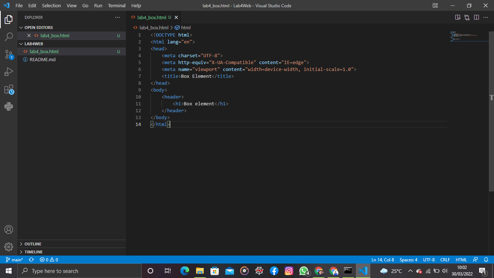
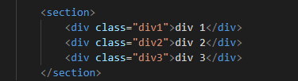
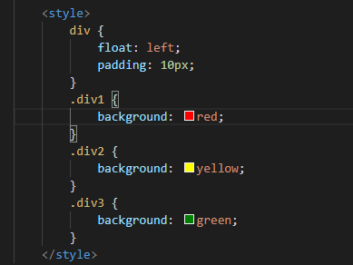
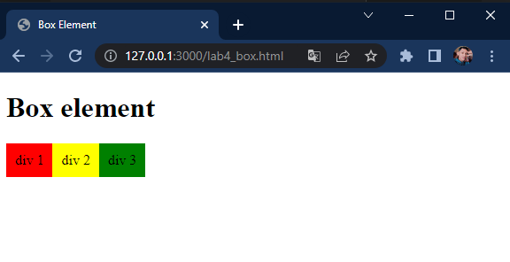
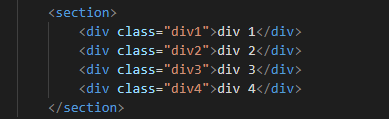
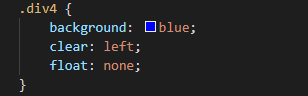
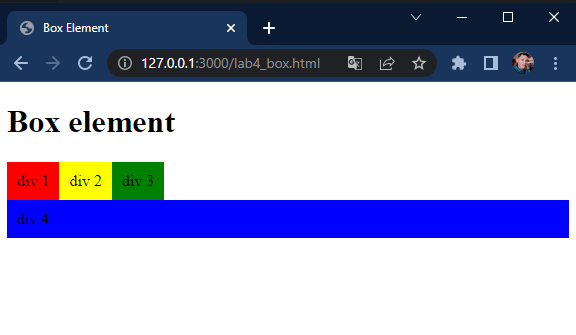
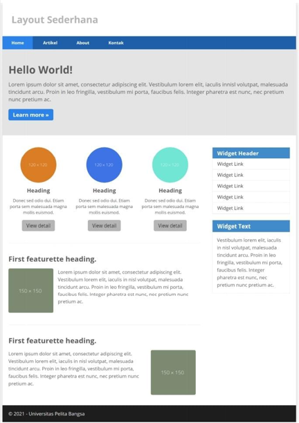

# Lab4Web
CSS Layout
*Langkah - langkah Praktikum dengan membuat nama File lab4_box.html Seperti berikut.*

*Box Element*
Dengan Menambahkan tag kode untuk membuat box element dengan tag div.

*CSS float Properti*
Dengan memberikan deklarasi CSS Di dalam head dan membuat float element seperti berikut.

Tampilannya seperti ini.

*Mengatur clearfix Element* 
Clearfix Digunakan untuk mengatur element setelah float element properti clear digunakan untuk mengaturnya. dengan menambahkan div detelah div3.

Kemuadian Tambahkan Properti clear pada CSS.

Lalu hasilnya sebagai berikut.

kita juga dapat mencoba properti clear lannya dengan left,both,right dan amatilah perubahannya.

*Membuat Layout Sederhana*
membuat Layout Web sederhana Seperti Berikut.

