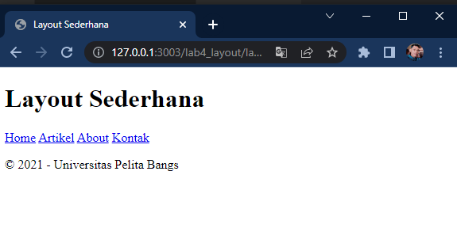
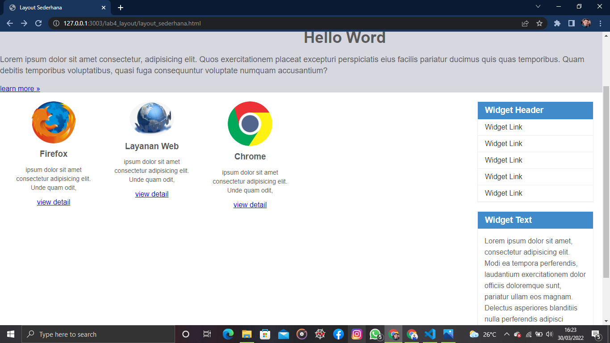
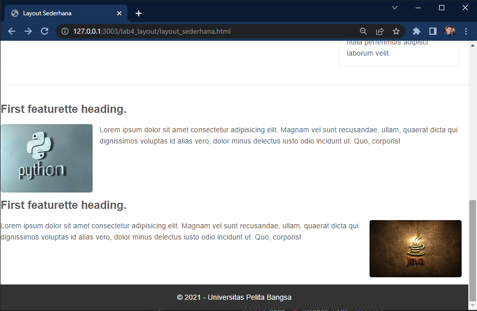

# Lab4Web
CSS Layout
*Langkah - langkah Praktikum dengan membuat nama File lab4_box.html Seperti berikut.*

*Box Element*
Dengan Menambahkan tag kode untuk membuat box element dengan tag div.

*CSS float Properti*
Dengan memberikan deklarasi CSS Di dalam head dan membuat float element seperti berikut.

Tampilannya seperti ini.

*Mengatur clearfix Element* 
Clearfix Digunakan untuk mengatur element setelah float element properti clear digunakan untuk mengaturnya. dengan menambahkan div detelah div3.

Kemuadian Tambahkan Properti clear pada CSS.

Lalu hasilnya sebagai berikut.

kita juga dapat mencoba properti clear lannya dengan left,both,right dan amatilah perubahannya.

*Membuat Layout Sederhana*
membuat Layout Web sederhana Seperti Berikut.

Membuat folder baru dengan nama lab4_layout kemudian buatlah file baru dengan nama home.html dan file css dengan nama Style.css

lalu buatlah kerangka layout dengan semantics element.

kemudian menggunkan tag seperti berikut.

lalu buka browser untuk melihat hasilnya.

Kemudian kita tambahkan kode CSS untuk membuat layoutnya.

Dan hasilnya.

*Membuat Navigasi*
kemudian selanjutnya mengatur navigasi

Dan Hasilnya 

*Membuat Hero Panel*
Selanjutnya kita membuat hero panel dengan menambahkan kode html dan css

Tag CSS seperti berikut

hal hasilnya seperti berikut

*Mengatur Layout Main dan Sidebar*
Selanjutnya mengatur main content dan sidebar dengan menambahkan CSS float.

*Membuat Sidebar Widget*
lalu kita menambahkan element lain dalam sidebar.

selanjutnya kita tambahkan CSS

Hasilnya Sebagai Berikut.

*Mengatur Footer*
Dengan mengatur tampilan footer kita juga tambahkan CSS untuk footer

Hasilnya Seperti berikut

*Menambahkan Element lainnya pada Main Content*

Lalu tambhakan CSS

Hasilnya SePerti ini

*Menambahkan Content Artikel*
selanjutnya kita membuat content artikel pada html di main conten

lalu tambahkan pada CSS

Dan Alhasilnya seperti berikut

*Pertanyaan Dan Tugas*
1. Tambahkan Layout untuk menu About => buat Singel layout yang berisi deskripsi,portofolio,dll
2. tambahkan layout untuk menu contant => yang berisi form isian:nama,email,message,dll

